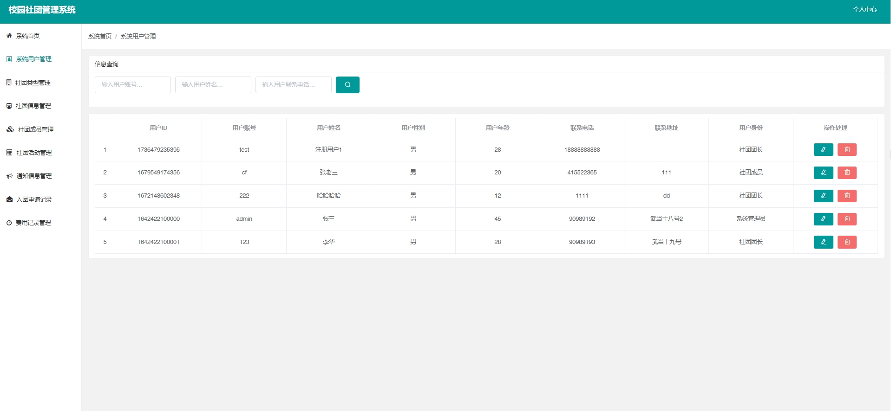
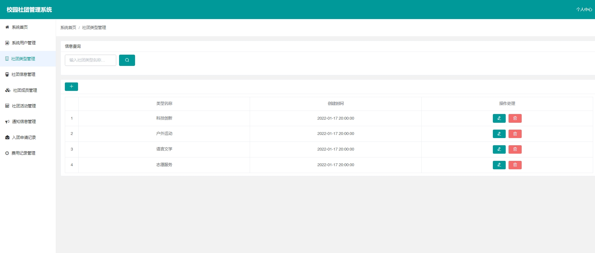
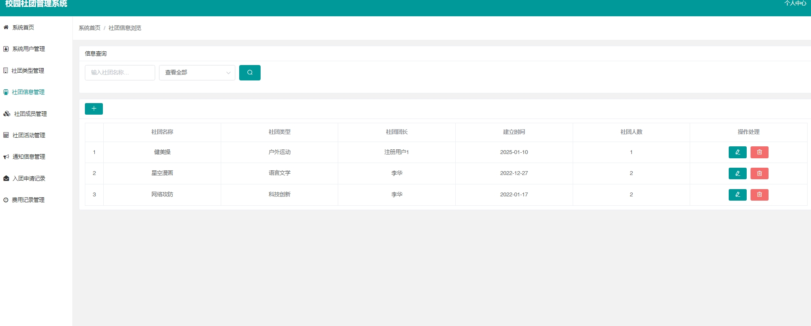
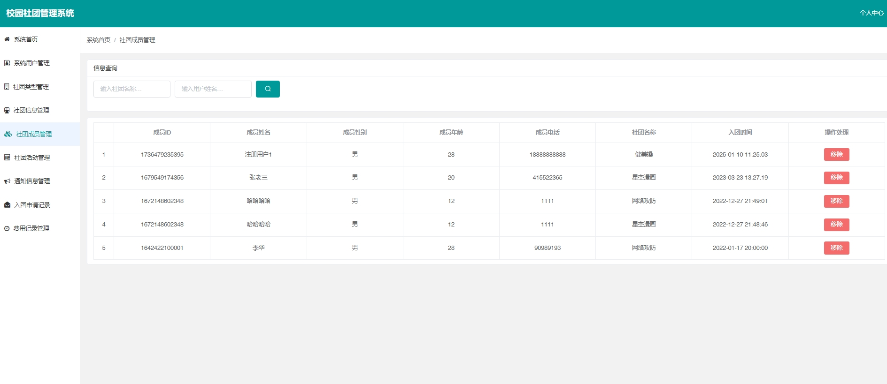
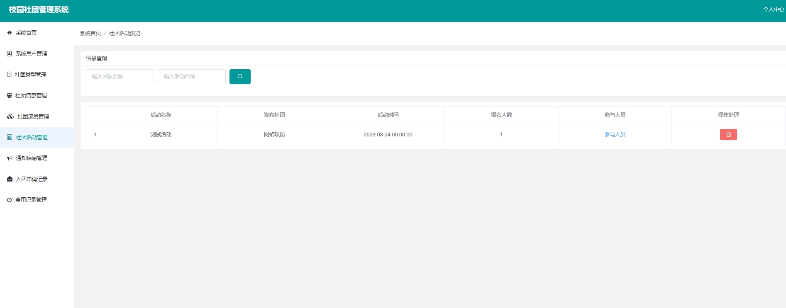
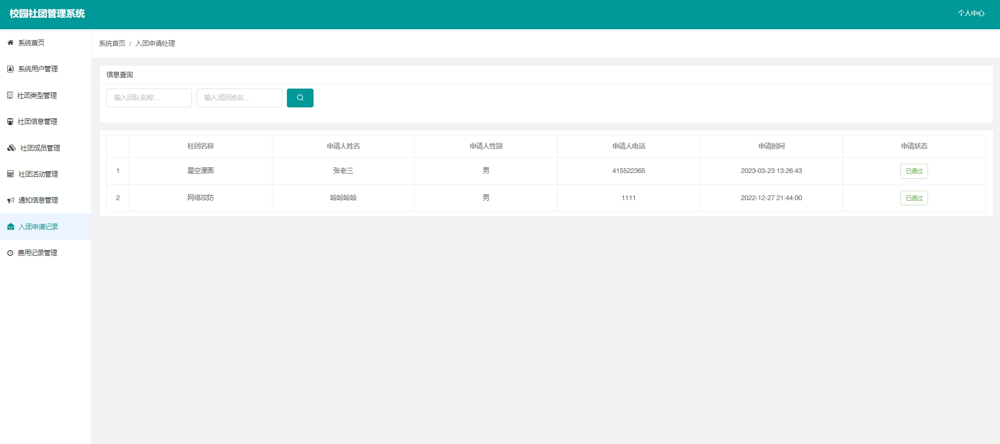

# 1.项目介绍
- 系统角色：管理员、学生、社团团长
- 功能模块：用户管理、社团类型管理、社团信息管理、社团成员管理、社团活动管理、通知信息管理、入团申请、费用记录等
- 技术栈：springboot、vue等
- 测试环境：idea2024，jdk8，maven3，node14.16.1，mysql5.7等
# 2.项目部署
## 2.1 后端
- 创建数据库，导入压缩包内的sql文件
- 通过idea打开项目server
- 根据本地数据库环境，配置src/main/resources/application.yml 18-21行
- 启动项目即可
## 2.2 管理web
- 通过idea打开项目（前提是idea安装了vue.js的插件）client，也可以通过vscode，或者webstorm打开，本地测试我用的是idea
- 终端运行npm install
- 然后运行  npm  run serve
- 成功后打开链接即可，管理员登录：admin、123456，其他用户角色说明：（注册用户都是社团成员，社团团长由管理员在创建社团的时候指定）
# 3.项目部分截图

# 4.获取方式
[戳我查看](https://gitee.com/aven999/mall)
